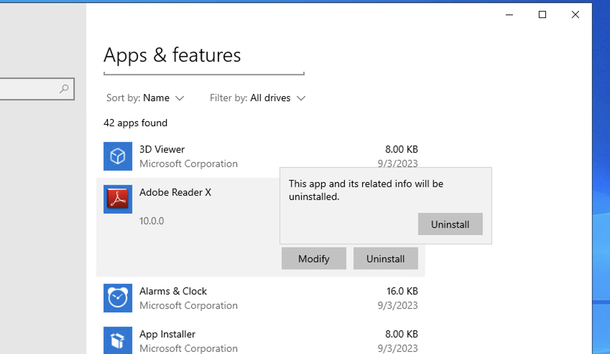

# Azure Vulnerability Management Lab Setup

## Prerequisites
- Computer with Internet access
- Azure Account (Free Subscription may be possible)
    - Create your Free Azure Account [here](https://azure.microsoft.com/en-us/free/)
    - Log in to your Azure Account [here](https://portal.azure.com)

## Prepare Vulnerability Management Scanner
1. Go to [Azure Portal](https://portal.azure.com).
2. Navigate to the Marketplace and search for "OpenVAS secured and supported by HOSSTED."
3. Choose "Start with a pre-set configuration" and select the weakest configuration.
4. Continue to create the VM:
    - Resource Group: Vulnerability-Management
    - VM Name: OpenVAS (Note the region and Vnet - consider East US 2)
    - Security: Standard
    - Authentication: Username → azureuser / Password → Cyberlab1234!
    - Monitoring: Disable Boot Diagnostic (not needed)
    - Management: Disable auto-deploy
5. Create the VM.
6. Once created, SSH into it using PowerShell (Windows) or Terminal (MacOS) with the credentials you created.

        sudo ssh username@ip
8. Wait for the deployment to complete, and it should display the web app URL and default username and password.

10. Copy the url and log in to the web app. If it doesn't work, try using admin/admin.
11. After logging in, reset the admin password to Cyberlab1234!

# Recap
1. We made an azure account
2. We made an OpenVAS VM which is out Vulnerability Management which has its own virtual network
3. Were going to create a Vulnerable VM and place it inside the OpenVAS VM network

## Create Client Virtual Machine and Make it Vulnerable
1. Go to [Azure Portal](https://portal.azure.com).
2. Search for Virtual Machines and create a new Virtual Machine.
3. Configure the VM:
    - Resource Group: Vulnerability-Management
    - VM Name: Win10-Vulnerable
    - Region: Same as the OpenVAS VM (East US 2)
    - Virtual Network: Same as OpenVAS
    - Image: Windows 10 Pro
    - Size: Any size with 2 vCPUs
    - Username: azureuser / Password: Cyberlab1234!
    - Networking: Same Vnet as OpenVAS
4. Create the VM.
5. Once created, ensure you can RDP into it with the credentials.
  - MacOS needs RDP app to access
    
    
8. Make the VM vulnerable by:
    - Disabling the Windows Firewall (Allows Vulnerability Scanner to Scan the VM without dropping traffic)
      - Start > wf.msc > Firewall Properties
        - Domain Profile > Off
        - Private Profile > Off
        - Public Profile > Off
    - Installing old software on Win10-Vulnerable VM! :
      - https://drive.google.com/drive/u/2/folders/1n83ilCjZWZulbDdYnUe9wQPK2buY47_U
        - Old Version of Firefox: Firefox Setup 97.0b5
        - Old Version of VLC Player: vlc-1.1.7-win32
        - Old Version of Adobe Reader: 10.0_AdbeRdr1000_en_US_1_
9. Restart the VM.

## Configure and Run Unauthenticated Scan with OpenVAS
1. Log in to OpenVAS.
2. Navigate to Assets → Hosts → New Host.
3. Add the Client VM PRIVATE IP Address.
  -Found in azure: VM > Win10-Vulerable Properties > Private IP
   
   
6. Create a new Target from the Host, name it "Azure Vulnerable VMs."
7. Take note of the credentials; SMB credentials will be added later.
8. Create a new Task:
    - Name & Comment: "Scan - Azure Vulnerable VMs"
    - Scan Targets: "Azure Vulnerable VMs"
9. Save the Task.
10. Start the "Scan - Azure Vulnerable VMs" Task.
11. Take note of the scan status.
12. After the scan finishes, click the date under "Last Report" to view the results.
13. Examine the "Results" tab. Note that some vulnerabilities may not appear due to the unauthenticated scan.
### Results
- The scan did not find the vulnerable installed apps since it was not an authenticated scan

## Configure Authenticated Scans (Within VM)
1. On the vulnerable Windows VM, perform the following configurations:
    - Disable Windows Firewall
    - Disable User Account Control
      - Start > "user account control" > set to "never notify"
      - 
    - Enable Remote Registry
      - Start > services.msc
      - Search for: Remote Registry > Properties > Startup type: Automatic > Apply > Start
      - 
    - Set Registry Key (LocalAccountTokenFilterPolicy: 1)
      - Start > regedit > HKEY_LOCAL_MACHINE > Open SOFTWARE\Microsoft\Windows\CurrentVersion\Policies\System
      - Create a new DWORD (32-bit) value with the following properties:
        - Name: LocalAccountTokenFilterPolicy
        - Value: 1
        - 
      - Restart VM

## Configure Authenticated Scans (OpenVAS)
1. In OpenVAS, go to Configuration → Credentials → New Credential.
2. Name / Comment: "Azure VM Credentials."
3. Allow Insecure Use: Yes
4. Username: azureuser
5. Password: Cyberlab1234!

7. Save.
8. Go to Configuration → Targets → Clone the Target previously created.
9. Name / Comment: "Azure Vulnerable VMs - Credentialed Scan."
10. Ensure the Private IP is still accurate.
11. Credentials → SMB → Select the "Azure VM Credentials" created earlier.

12. Save.

## Execute Authenticated Scan against Vulnerable Windows VM
1. In OpenVAS, go to Scans → Tasks.
2. Clone the "Scan - Azure Vulnerable VMs" Task and edit it:
    - Name / Comment: "Scan - Azure Vulnerable VMs - Credentialed."
    - Targets: Azure Vulnerable VMs - Credentialed Scan
 

3. Save.
4. Launch the new Credentialed Scan and wait for it to finish (this may take longer).
5. After the credentialed scan finishes, check SMB Login under "Results."
6. Inspect individual vulnerabilities, including critical findings related to outdated software.
7. Remove the filter (upper right).

 

## Remediate Vulnerabilities
1. Log back into your Win10-Vulnerable VM.
2. Uninstall Adobe Reader, VLC Player, and Firefox.
3. Update windows
   
   
4. Restart the VM.

## Verify Remediations
1. Re-initiate the "Scan - Azure Vulnerable VMs - Credentialed" scan and observe the results.

 

## Additional Options
- Explore other options to intentionally make your Client VM Vulnerable with ChatGPT using these prompts: [Ideas for Vulnerability Creation](#ideas-for-vulnerability-creation).

## Resume Entry
**Cybersecurity Vulnerability Management Project**
- Set up a secure Azure network with an OpenVAS Vulnerability Management Scanner VM.
- Developed a vulnerable Windows 10 VM, featuring outdated software and disabled security controls.
- Performed unauthenticated and credentialed vulnerability scans using OpenVAS.
- Analyzed scan results, highlighting the difference between unauthenticated and credentialed scans.
- Remediated identified vulnerabilities, verified successful remediation through subsequent scans.
- Created a list of remediable vulnerabilities to simulate realistic vulnerability remediation scenarios.
