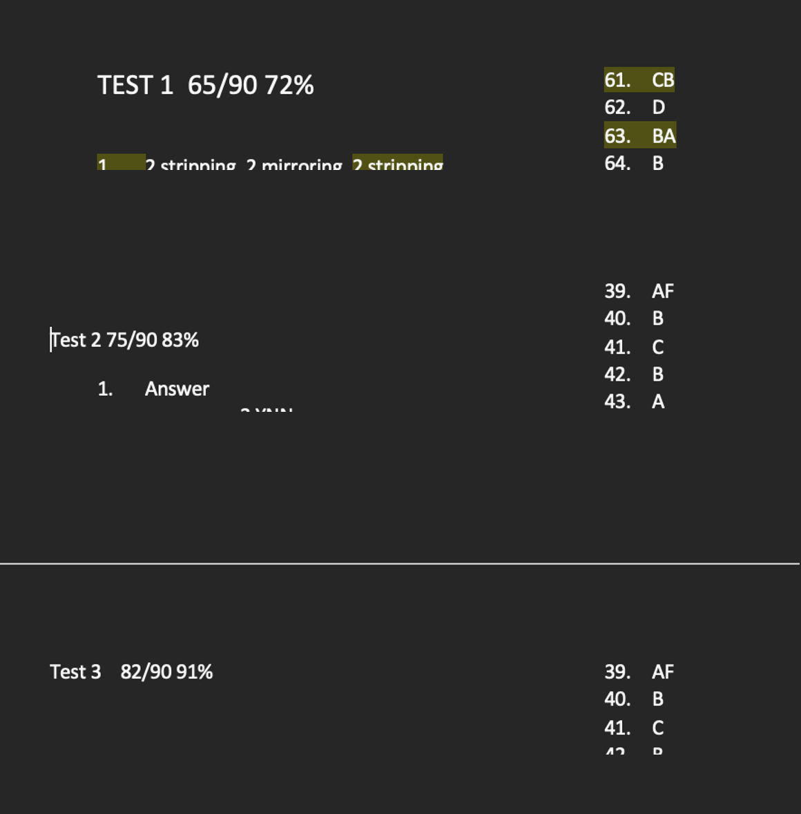
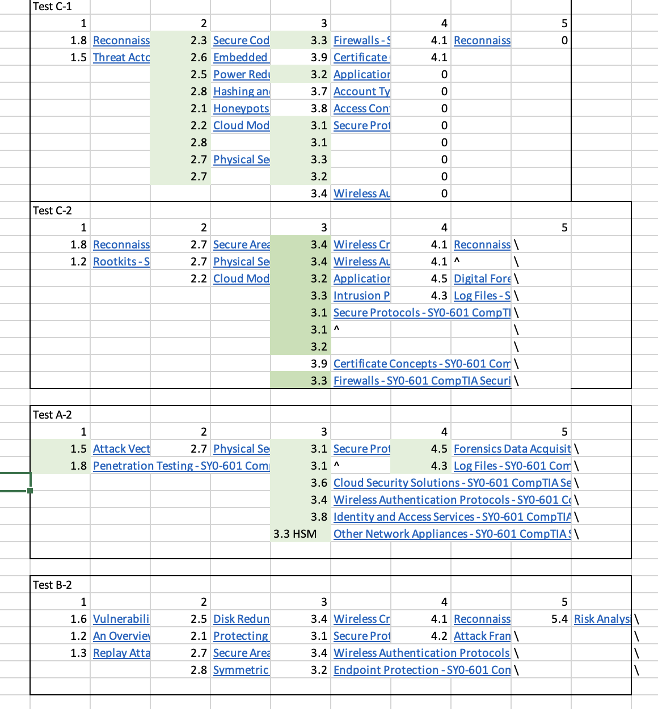

# CompTIA Security+ Certification Resources

Welcome to the CompTIA Security+ certification resources page! This collection of materials is designed to help you prepare for and pass the CompTIA Security+ exam. Whether you're a beginner or looking to brush up on your skills, these resources will be valuable on your journey to success. 

## Table of Contents

1. [Introduction](#introduction)
2. [Study Guides](#study-guides)
3. [Practice Exams](#practice-exams)
4. [Online Courses](#online-courses)
5. [Videos](#videos)
6. [Interactive Labs](#interactive-labs)
7. [Communities](#communities)
8. [Additional Tips](#additional-tips)

---

## Introduction

Welcome to my personal CompTIA Security+ success story! I'm excited to share my journey and the strategies that helped me not only pass but excel in the CompTIA Security+ certification exam. Whether you're a cybersecurity enthusiast, a beginner, or someone aiming to boost your career, I hope my experience can provide valuable insights and guidance on your path to success.

## Background

I don't have the A+ or the Net+, though I do have a Bachelor's in IT. After completing the Sec+, I do believe getting the Net+ or the CCNA would be beneficial for understanding foundational concepts, I think my experience in the Ethical Hacking courses helped me fill my Network gaps otherwise I probably would have benefitted from getting the Net+ first.

## Why CompTIA Security+?

Before diving into my journey, let's briefly discuss why CompTIA Security+ is a pivotal certification for anyone aspiring to excel in the field of cybersecurity. CompTIA Security+ is renowned for its industry recognition, covering essential cybersecurity topics, and serving as a stepping stone for various cybersecurity career paths.

## Study Guides

- Professer Messer Notes
  - https://www.professormesser.com/sy0-601-success-bundle/
- Dion Training Study Guide (Provided with Course)
  - https://www.udemy.com/course/securityplus/
- Study Guide I created with the concepts I struggled with the most
  - https://github.com/selidrium/CyberSecurity-Portfolio/blob/5c0a43420bf4cbdc36d01cc284c549b280b1080d/Resources/SecPlus.docx

## Practice Exams
 Whenever you finish the exam, grade them but don't look at the answers. Instead, try to figure out why you got it wrong and what could possibly be the correct answer
- Professor Messer 3 Practice Tests
  - https://www.professormesser.com/sy0-601-success-bundle/
- Dion Training 6 Practice Exams + PBQs
  - https://www.udemy.com/course/security-601-exams/

## Online Courses
- Always have the CompTIA objectives showing on a separate screen when going through the videos
- First, thoroughly watch all Professor Messer's Playlist, it covers all of the objectives completely
  - https://www.comptia.org/training/resources/exam-objectives
- Professor Messer Security+
  - https://www.youtube.com/watch?v=9NE33fpQuw8&list=PLG49S3nxzAnkL2ulFS3132mOVKuzzBxA8&ab_channel=ProfessorMesser
- Use the cram to watch over domains you are struggling with, and to get a refresher of all of the domains effectively before the exam
- Security+ Cram
  - https://www.youtube.com/watch?v=9Hd8QJmZQUc&list=PL7XJSuT7Dq_VD3eHXQf3Ld2ceBSFCayns&ab_channel=InsideCloudandSecurity
- Dion's training was the first course I started, but I found it lacked a lot of the exam objectives, so I would leave it for last, as a source of supplemental knowledge
- Dion Training
  - https://www.udemy.com/course/securityplus/

## Videos

 Whenever I had trouble understanding some Networking objectives, I found watching visual lessons helpful
- Visual Learning for Network Concepts
  - https://www.youtube.com/@PowerCertAnimatedVideos

## Interactive Labs
 Whenever I felt burnt out, I would practice some ethical hacking and it helped me learn more about the tools covered in the exam objectives.

- Participate in CTFs to solidify tools
  - https://ctftime.org/
- Practical Ethical Hacking Course by TCM Academy
  - https://academy.tcm-sec.com/p/practical-ethical-hacking-the-complete-course

## Communities

- Join Professor Messers Discord!
  - It helps a lot to connect and chat with other people with similar goals, they'll tell you about their experience with the exam as well as how they are able to understand difficult-to-learn objectives
  - https://www.professormesser.com/ (click the join discord chat)
- Join CertJunkies Sec+
  - I couldn't find a link for them, but I joined them through networking in Professor Messer's discord
  - Study groups!!

## Additional Tips 

- **Exam Tips**:
  - I personally took the exam online via Pearson PurVUE
  - SKIP THE PBQs!! Go back to them once you finish all the multiple-choice questions

## Challenges and How I Overcame Them

- The hardest domains are by far:
  - Domain 2
  - Domain 3
- I spent the most time reviewing those domains, rewatching all of Professor Messer's videos that cover those specific domains, as well as the Security+ Cram videos for the specific domains.
- Keep track of your progress, I would make a Word document for each Professe Messer Exam, set it up into 3 columns, and every page covered a new attempt. Every page showed improvement, which boosts confidence, a good marker to let you know you are ready.

- Professor Messer does a great job of letting you know what objective and domain you missed and provides a link to the video covering that objective on the exam answers.
- I used Excel to create a spreadsheet that tracked which areas I was lacking in the most, and what videos I needed to watch, once I watched the video or the domain, I highlighted them in green to let me know I watched them already, and once I covered all of my missed objectives, I tried the exam again. Each time I noticed the list was getting smaller and smaller.

Excel Template Download:
https://github.com/selidrium/CyberSecurity-Portfolio/raw/main/Resources/Progress_Tracker_Template.xlsx

## Results and What's Next

- After 6 weeks of studying, I decided to bite the bullet and take the exam, I passed with an 805.
  
## Final Thoughts

- You will never feel completely prepared for the exam, but you will reach a point where you don't think you can do anything else to cover more since you have exhausted all your resources, and taken the exams too many times, I believe this is when you know you are ready for the exam.
- Take a leap of faith!

---

Feel free to contribute to this list by adding more resources or updating existing ones. Good luck with your CompTIA Security+ journey!
